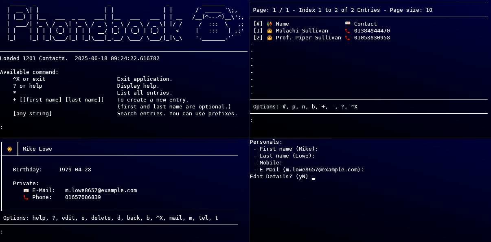

# PhoneBook



A simple terminal-based phonebook application designed to help organize contacts. This project was created for teaching programming basics.

## Features

- **Contact Management**: Create, edit, delete, and view contact entries
- **Detailed Contact Information**: Store personal, private, and work information for each contact
  - Personal details: First name, last name, title, nickname, organization, birthday, gender
  - Contact details: Phone, mobile, fax, email, and address information
  - Work details: Separate work contact information and address
  - Notes: Add multi-line notes to contacts
- **Search Functionality**: Find contacts using various search criteria
  - Basic search by name
  - Advanced search with prefixes:
    - `all:` - Search using all text fields
    - `#all:` - Search using all fields including numbers
    - `org:` - Search by organization
    - `add:` - Search by address text fields
    - `#add:` - Search by address including numbers
    - `@:` - Search by email
    - `#:` - Search by phone/mobile number
- **Pagination**: Browse through contacts with next/previous page navigation
- **Direct Actions**: Send emails or make calls directly from contact entries
- **Multi-detail Storage**: Separate private and work contact details
- **JSON Storage**: Contacts are stored as individual JSON files in user's home directory

## Installation

1. Clone the repository:
   ```
   git clone https://github.com/yourusername/PhoneBook.git
   cd PhoneBook
   ```

2. No additional dependencies are required beyond Python 3.6+

## Usage

Run the application:
```
python main.py
```

### Main Menu Commands

- `exit` or `^X` - Exit the application
- `?` or `help` - Display help
- `*` - List all entries
- `+ [first name] [last name]` - Create a new entry (name parameters are optional)
- `[any string]` - Search entries by name or using prefixes

### Entry Management

When viewing an entry, you can:
- Edit entry details
- Delete the entry
- Send an email to the contact
- Call the contact's phone number
- Add or edit notes

### Entry Editing Controls

- `^A` - Abort editing without saving changes
- `^X` - Exit and save changes
- `^D` - Delete a field's content
- `?` - Show help

## Project Structure

- `main.py` - Main entry point for the application
- `database.py` - Database management functionality
- `entry.py` - Classes for contact information
- `input_lib.py` - Input handling utilities
- `path_config.py` - File path configuration

## Data Storage

The application stores contacts in the user's home directory under a folder named `phonebook`. Each contact is saved as a separate JSON file with the `.jcontact` extension.

## Documentation

Documentation is available in the `documentation` folder and can be regenerated using:

```bash
./generate_docu.sh
```

This requires `pdoc` and `pandoc` to be installed:

```bash
pip install pdoc
# Install pandoc using your system's package manager
```

## License

This project is licensed under the GNU General Public License v3.0 - see the [LICENSE](LICENSE) file for details.
